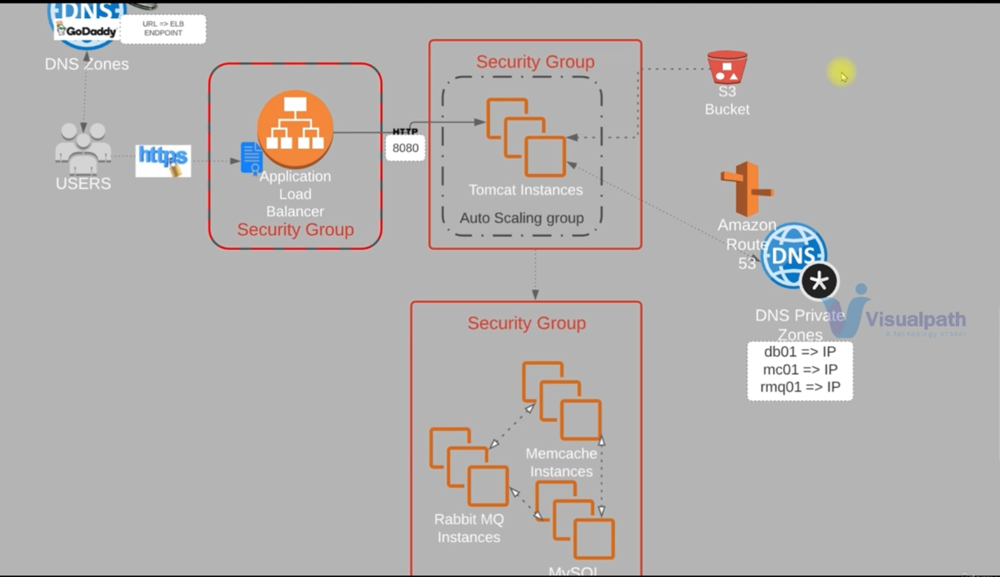
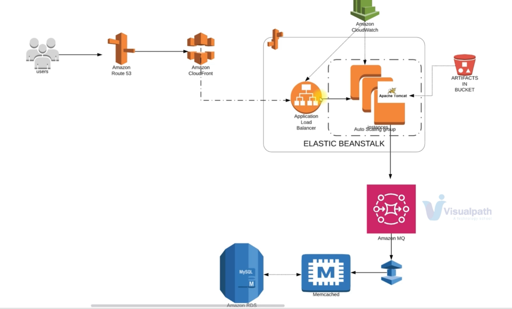
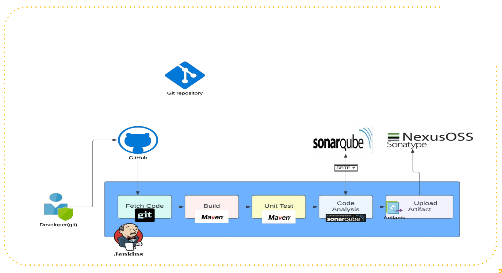

# DevOps Project

## Tech Stack
- Spring Boot app
- Rabbit MQ
- Memcached
- MySQL

## Lift and Shift Approach

This project follows a "Lift and Shift" approach, implemented via shell scripts to automate the installation of various services on EC2 instances.

### Spring Boot Application

#### EC2 Instance
- Launch an EC2 instance for the Spring Boot app.
- Configure Java, Tomcat, and app dependencies.
- Place the instance in the "spring-app-sg" security group.

#### Auto Scaling Group
- Set up Auto Scaling Group for scalability.
- Define scaling policies based on metrics.

#### Application Load Balancer (ALB)
- Create an ALB to distribute incoming traffic.
- Configure listeners, health checks, etc.

#### Target Group
- Associate a target group with instances running the Spring Boot app.
- Attach the target group to the ALB.

### Backend Services (RabbitMQ, Memcached, MySQL)

#### EC2 Instances
- Launch separate EC2 instances for each service.
- Install and configure RabbitMQ, Memcached, and MySQL.

#### Security Group ("backend-sg")
- Create a common security group for backend instances.
- Define inbound/outbound rules to allow necessary traffic.

### Routing and DNS with Route 53

#### Route 53
- Use Route 53 to manage domain and DNS settings.

#### Alias Record
- Create an alias record in Route 53 pointing to the ALB.
- Ensure correct domain configuration to route traffic to the ALB.

## Streamlined AWS Deployment: Elastic Beanstalk, Managed Services, and CDN Integration

To avoid operational/management overhead, let's use PaaS services in AWS.

### 1. Modernizing Deployment with AWS Elastic Beanstalk:

#### Elastic Beanstalk Ease:
- Deploy the Spring Boot application effortlessly on AWS Elastic Beanstalk.
- Leverage Elastic Beanstalk's simplicity for environment creation and management.

#### Artifact Deployment from S3:
- Store the Spring Boot application artifact in an S3 bucket.
- Configure Elastic Beanstalk to seamlessly retrieve the artifact from S3 during deployment.

### 2. Enhanced Backend Services with AWS Managed Offerings:

#### AWS MQ for Messaging Excellence:
- Utilize AWS MQ (Managed Apache ActiveMQ) for messaging.
- Set up an AWS MQ broker for a fully managed messaging solution.

#### ElastiCache for Efficient Caching:
- Leverage AWS ElastiCache for caching needs, replacing traditional Memcached.
- Create an ElastiCache cluster for seamless integration with the Spring Boot application.

#### RDS for MySQL Management:
- Opt for AWS RDS for MySQL to simplify database management.
- Migrate the MySQL database to RDS for a fully managed database service.

### 3. Auto Scaling with Elastic Beanstalk:

#### Built-in Auto Scaling Support:
- Harness Elastic Beanstalk's inherent support for Auto Scaling.
- Configure Auto Scaling settings within the Elastic Beanstalk environment for dynamic scaling based on demand.

### 4. DNS and CDN Optimization:

#### Route 53 for Effortless DNS Management:
- Utilize AWS Route 53 for streamlined DNS management.
- Configure Route 53 to map the application domain to the Elastic Beanstalk environment URL.

#### CloudFront for Accelerated Content Delivery:
- Implement AWS CloudFront to act as a Content Delivery Network (CDN).
- Enhance content delivery, reduce latency, and bolster security with CloudFront integration.

## CI Pipeline with Jenkins, SonarQube, and Nexus

Continuous Integration (CI) is a software development practice that involves frequently integrating code changes from multiple contributors into a shared repository. The primary goal of CI is to detect and address integration issues early in the development process.

### Overview

This project employs a robust CI pipeline utilizing Jenkins, SonarQube, and Nexus on EC2 instances. Each tool plays a crucial role in automating the build, analysis, and artifact storage processes.

### Usage

#### Jenkins

- **Code Build and Integration**: Jenkins orchestrates the build process by fetching code, compiling, running tests, and generating artifacts.

- **Continuous Integration**: Jenkins monitors version control for changes, triggering builds automatically to ensure continuous integration.

- **Configuration**: Define build and deployment processes using Jenkins pipeline scripts or freestyle jobs through the web interface or Jenkinsfiles.

- **Integration with SonarQube and Nexus**: Utilize Jenkins plugins to seamlessly integrate with SonarQube for code analysis and Nexus for artifact storage.

#### SonarQube

- **Code Analysis**: SonarQube conducts static code analysis, identifying code smells, bugs, and security vulnerabilities.

- **Integration with Jenkins**: Configure Jenkins jobs to trigger SonarQube analysis as part of the build process using the SonarQube Scanner plugin.

- **Dashboard and Reports**: Access the SonarQube web dashboard for detailed reports on code quality, providing insights into issues, code coverage, and maintainability.

#### Nexus

- **Artifact Storage**: Nexus serves as a centralized repository for storing build artifacts, including JARs, WARs, and dependencies.

- **Integration with Jenkins**: Jenkins jobs are configured to deploy artifacts to Nexus after successful builds, ensuring versioned and easily retrievable artifacts.

- **Repository Management**: Use Nexus to create repositories, manage access controls, and efficiently store and retrieve artifacts.

- **Dependency Management**: Nexus proxies and caches dependencies from external repositories, reducing build times and maintaining a reliable build environment.

### Overall Usage Flow

1. **Code Changes**: Developers push changes to the version control system (e.g., GitHub).

2. **Jenkins Trigger**: Jenkins monitors the repository (via github hooks on push event), triggering builds upon code changes.

3. **Build and Analysis**: Jenkins fetches code, builds it, runs tests, and conducts SonarQube analysis for code quality.

4. **SonarQube Report**: Developers access the SonarQube dashboard to review analysis reports and address issues.

5. **Artifact Deployment**: Successful builds result in artifact deployment to Nexus for versioned storage.

6. **Artifact Retrieval**: Teams retrieve artifacts from Nexus for downstream processes or deployment.

By integrating these tools, the project establishes a comprehensive CI/CD pipeline with automated code analysis and efficient artifact management, ensuring high-quality code and reliable artifact storage.

